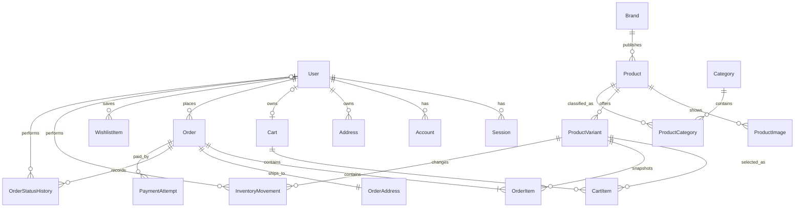

# 14. 데이터 모델과 무결성 규칙

## 문서 목적

HUKUPUKU MVP의 PostgreSQL 데이터 구조, 관계, 제약조건, 인덱스와 트랜잭션 경계를 정의합니다. 실제 Prisma schema와 migration은 6단계에서 이 문서를 기준으로 작성합니다.

## 모델링 원칙

1. 금액은 원 단위 정수로 저장하고 계산에 부동소수점을 사용하지 않습니다.
2. 상품 옵션 하나가 판매와 재고의 최소 단위이며 고유 SKU를 가집니다.
3. 주문은 상품·옵션·가격·배송지의 당시 값을 snapshot으로 보관합니다.
4. 재고·주문 상태 변경은 현재값뿐 아니라 변경 이력을 남깁니다.
5. 공개 식별자와 내부 기본키를 분리합니다.
6. DB 제약조건으로 표현할 수 있는 규칙을 애플리케이션 검증에만 맡기지 않습니다.
7. 주문 이력에 연결된 데이터는 물리 삭제하지 않고 상태로 보관합니다.

## ERD



`Verification`은 Better Auth가 이메일 확인과 비밀번호 재설정 등에 사용하는 독립 인증 테이블이며 ERD의 도메인 관계에서는 생략했습니다.

## 공통 규칙

| 항목 | 선택 |
| --- | --- |
| 내부 ID | UUID, URL에 직접 노출하지 않음 |
| 시간 | PostgreSQL `timestamptz`, 서버에서 UTC 저장, 화면에서 사용자 시간대로 표시 |
| 생성·수정 | mutable table은 `createdAt`, `updatedAt` 보유 |
| 화폐 | KRW 정수, 필드명에 `Amount` 또는 `Price` 사용 |
| 공개 상품 식별자 | 변경 규칙을 관리하는 고유 `slug` |
| 공개 주문 식별자 | 추측하기 어려운 고유 `orderNo` |
| 이메일 | trim + lowercase 정규화 후 unique |
| 삭제 | 주문 참조 상품·옵션·사용자는 기본적으로 보관 또는 비활성화 |

## 인증과 사용자

Better Auth CLI가 생성하는 `User`, `Session`, `Account`, `Verification` 필드를 먼저 생성하고 아래 도메인 필드를 합칩니다. 정확한 필드명은 6단계에서 설치한 Better Auth 버전의 생성 결과를 기준으로 하며 임의로 축약하지 않습니다.

### User

| 필드 | 형식 | 규칙 |
| --- | --- | --- |
| `id` | UUID | PK |
| `email` | text | 정규화, unique, not null |
| `name` | text | 1~80자 |
| `role` | UserRole | 기본 `MEMBER`, 공개 가입으로 `ADMIN` 설정 금지 |
| `emailVerified` | boolean | 인증 라이브러리 정책 |
| `image` | text nullable | MVP에서는 입력받지 않음 |
| `createdAt`, `updatedAt` | timestamptz | not null |

```text
UserRole = MEMBER | ADMIN
```

### Address

| 필드 | 형식 | 규칙 |
| --- | --- | --- |
| `id` | UUID | PK |
| `userId` | UUID | User FK, 소유권 검사 |
| `label` | text | 예: 기본 배송지 |
| `recipient` | text | 1~80자 |
| `phone` | text | 정규화된 국내 전화번호 형식 |
| `postalCode` | text | 문자열로 보관 |
| `address1`, `address2` | text | 최대 길이 검증 |
| `isDefault` | boolean | 사용자당 하나만 허용 |

- 사용자별 기본 배송지 하나는 partial unique index로 보장합니다.
- 주문이 참조하는 주소는 `OrderAddress` snapshot으로 복사하므로 이후 수정이 과거 주문을 바꾸지 않습니다.

## 카탈로그

### Brand

| 필드 | 형식 | 규칙 |
| --- | --- | --- |
| `id` | UUID | PK |
| `name` | text | unique, not null |
| `slug` | text | unique, 소문자 kebab-case |
| `description` | text nullable | 가상 브랜드 설명 |
| `isActive` | boolean | 기본 true |

### Category

| 필드 | 형식 | 규칙 |
| --- | --- | --- |
| `id` | UUID | PK |
| `name` | text | not null |
| `slug` | text | unique |
| `sortOrder` | integer | 0 이상 |
| `isActive` | boolean | 기본 true |

### Product

| 필드 | 형식 | 규칙 |
| --- | --- | --- |
| `id` | UUID | PK |
| `brandId` | UUID | Brand FK, restrict delete |
| `name` | text | 1~160자 |
| `slug` | text | unique, 공개 URL |
| `description` | text | 상품 설명 |
| `material` | text | 소재 정보 |
| `listPrice` | integer | 0보다 큼 |
| `salePrice` | integer | 0보다 크고 `listPrice` 이하 |
| `status` | ProductStatus | 기본 `DRAFT` |
| `publishedAt` | timestamptz nullable | ACTIVE 전환 시 기록 |
| `createdAt`, `updatedAt` | timestamptz | not null |

```text
ProductStatus = DRAFT | ACTIVE | SOLD_OUT | ARCHIVED
```

- 할인율은 `(listPrice - salePrice) / listPrice`로 계산하고 저장하지 않습니다.
- `ACTIVE`여도 판매 가능한 variant 재고가 없으면 고객 화면은 품절로 표시합니다.
- `ARCHIVED`는 신규 탐색에서 제외하되 과거 주문과 관리자 이력에서는 유지합니다.

### ProductImage

| 필드 | 형식 | 규칙 |
| --- | --- | --- |
| `id` | UUID | PK |
| `productId` | UUID | Product FK |
| `url` | text | 허용된 이미지 origin 또는 관리 저장소 URL |
| `alt` | text | 이미지 의미에 맞는 대체 텍스트 |
| `sortOrder` | integer | 0 이상 |

- `(productId, sortOrder)`는 unique입니다.
- 첫 이미지가 상품 카드 대표 이미지입니다.

### ProductVariant

| 필드 | 형식 | 규칙 |
| --- | --- | --- |
| `id` | UUID | PK |
| `productId` | UUID | Product FK, restrict delete |
| `sku` | text | unique, 변경 제한 |
| `colorName` | text | 정규화된 표시명 |
| `colorCode` | text nullable | `#RRGGBB`, 텍스트 라벨을 대체하지 않음 |
| `size` | text | S, M, L 또는 상품별 규격 |
| `stock` | integer | 0 이상 |
| `isActive` | boolean | 기본 true |
| `version` | integer | 동시 수정 검사용, 기본 0 |
| `createdAt`, `updatedAt` | timestamptz | not null |

- `(productId, colorName, size)` 조합은 unique입니다.
- 재고와 상품 상태를 모두 만족해야 판매 가능합니다.
- 주문 이력이 있는 variant는 삭제하지 않고 `isActive=false`로 전환합니다.

### ProductCategory

| 필드 | 형식 | 규칙 |
| --- | --- | --- |
| `productId` | UUID | Product FK |
| `categoryId` | UUID | Category FK |

- 복합 PK `(productId, categoryId)`를 사용합니다.

## 장바구니와 찜

### Cart

| 필드 | 형식 | 규칙 |
| --- | --- | --- |
| `id` | UUID | PK |
| `userId` | UUID nullable | 로그인 장바구니, unique |
| `anonymousTokenHash` | text nullable | Guest 쿠키 원문을 저장하지 않음, unique |
| `createdAt`, `updatedAt` | timestamptz | not null |

- `userId`와 `anonymousTokenHash` 중 정확히 하나가 존재하도록 check constraint를 둡니다.
- Guest 쿠키에는 충분히 무작위인 원문 토큰, DB에는 단방향 hash만 저장합니다.
- 로그인 병합 후 Guest 항목을 Member cart로 이동하고 Guest cart는 같은 트랜잭션에서 정리합니다.

### CartItem

| 필드 | 형식 | 규칙 |
| --- | --- | --- |
| `id` | UUID | PK |
| `cartId` | UUID | Cart FK, cascade delete |
| `variantId` | UUID | ProductVariant FK, restrict delete |
| `quantity` | integer | 1 이상, 애플리케이션 최대 10 |
| `priceAtAdded` | integer | 담을 당시 판매가, 변경 안내 비교용 |
| `createdAt`, `updatedAt` | timestamptz | not null |

- `(cartId, variantId)`는 unique이며 같은 옵션을 다시 담으면 수량을 합칩니다.
- `priceAtAdded`는 주문 가격이 아니며 체크아웃은 Product 최신 가격을 다시 사용합니다.

### WishlistItem (P1)

| 필드 | 형식 | 규칙 |
| --- | --- | --- |
| `userId` | UUID | User FK |
| `productId` | UUID | Product FK |
| `createdAt` | timestamptz | not null |

- 복합 PK `(userId, productId)`로 중복 찜을 막습니다.

## 주문과 결제

### Order

| 필드 | 형식 | 규칙 |
| --- | --- | --- |
| `id` | UUID | PK |
| `orderNo` | text | unique, 공개 식별자 |
| `userId` | UUID | User FK, restrict delete |
| `idempotencyKey` | text | 요청별 불투명 키 |
| `status` | OrderStatus | 기본 `PENDING_PAYMENT` |
| `itemsAmount` | integer | 상품 판매가 합계 |
| `discountAmount` | integer | 정가 합계와 판매가 합계 차이, 0 이상 |
| `shippingAmount` | integer | 0 이상 |
| `totalAmount` | integer | `itemsAmount + shippingAmount` |
| `isTest` | boolean | MVP는 항상 true |
| `paidAt`, `cancelledAt` | timestamptz nullable | 상태 시간 |
| `createdAt`, `updatedAt` | timestamptz | not null |

```text
OrderStatus = PENDING_PAYMENT | PAID | PREPARING | SHIPPED | DELIVERED | CANCELLED
```

- `(userId, idempotencyKey)`는 unique입니다.
- `totalAmount = itemsAmount + shippingAmount`와 모든 금액 0 이상을 check constraint로 검증합니다.
- 할인은 별도 차감 항목으로 이중 계산하지 않습니다. `itemsAmount`는 이미 판매가 합계이며 `discountAmount`는 정보·감사 목적입니다.
- DB 순번을 `orderNo`로 사용하지 않습니다.

### OrderItem

| 필드 | 형식 | 규칙 |
| --- | --- | --- |
| `id` | UUID | PK |
| `orderId` | UUID | Order FK |
| `variantId` | UUID | ProductVariant FK, restrict delete |
| `productName` | text | 주문 시점 snapshot |
| `brandName` | text | 주문 시점 snapshot |
| `sku` | text | 주문 시점 snapshot |
| `colorName`, `size` | text | 주문 시점 snapshot |
| `listUnitPrice` | integer | 주문 당시 정가 |
| `saleUnitPrice` | integer | 주문 당시 판매가 |
| `quantity` | integer | 1 이상 |
| `lineAmount` | integer | `saleUnitPrice × quantity` |

- snapshot 필드는 현재 Product가 바뀌어도 변경하지 않습니다.
- `lineAmount`와 단가·수량 관계를 서비스에서 계산하고 테스트로 보호합니다.

### OrderAddress

| 필드 | 형식 | 규칙 |
| --- | --- | --- |
| `orderId` | UUID | PK이자 Order FK, 1:1 |
| `recipient`, `phone` | text | 주문 당시 배송 정보 |
| `postalCode`, `address1`, `address2` | text | 주문 당시 배송 정보 |

- 주소 snapshot은 사용자 주소 수정과 분리합니다.
- 고객 DTO에서는 본인에게만 전체 값을 제공하고 로그·관리자 목록에서는 마스킹합니다.

### PaymentAttempt

| 필드 | 형식 | 규칙 |
| --- | --- | --- |
| `id` | UUID | PK |
| `orderId` | UUID | Order FK |
| `provider` | text | MVP는 `TEST`만 허용 |
| `providerRef` | text | unique, 가상 결제 참조 |
| `status` | PaymentStatus | 처리 결과 |
| `amount` | integer | Order totalAmount와 일치 |
| `processedAt` | timestamptz nullable | 처리 시간 |
| `createdAt` | timestamptz | not null |

```text
PaymentStatus = PENDING | SUCCEEDED | FAILED
```

- 실제 카드 번호, CVC, 결제 토큰을 입력받거나 저장하지 않습니다.

### OrderStatusHistory

| 필드 | 형식 | 규칙 |
| --- | --- | --- |
| `id` | UUID | PK |
| `orderId` | UUID | Order FK |
| `fromStatus` | OrderStatus nullable | 최초 생성은 null |
| `toStatus` | OrderStatus | 변경 후 상태 |
| `actorUserId` | UUID nullable | 시스템 처리는 null |
| `reason` | text nullable | 취소·수정 사유 |
| `createdAt` | timestamptz | append-only |

- 기존 행을 수정·삭제하지 않는 append-only 이력입니다.
- 현재 상태는 Order에 두어 일반 조회를 단순하게 하고 History로 변경 근거를 추적합니다.

## 재고 감사

### InventoryMovement

| 필드 | 형식 | 규칙 |
| --- | --- | --- |
| `id` | UUID | PK |
| `variantId` | UUID | ProductVariant FK |
| `type` | InventoryMovementType | 변경 원인 |
| `quantityDelta` | integer | 0이 아닌 증감값 |
| `stockBefore`, `stockAfter` | integer | 모두 0 이상 |
| `orderId` | UUID nullable | 주문 관련 변경 |
| `actorUserId` | UUID nullable | 관리자 변경 수행자 |
| `reason` | text | 사람이 이해할 수 있는 사유 |
| `createdAt` | timestamptz | append-only |

```text
InventoryMovementType = ORDER_DECREMENT | ORDER_CANCEL_RESTORE | ADMIN_ADJUSTMENT | SEED
```

- `stockAfter = stockBefore + quantityDelta`를 검증합니다.
- 주문 차감·복구 movement는 `(orderId, variantId, type)` unique로 중복 적용을 방지합니다.
- 주문 재고 차감과 movement 생성은 같은 트랜잭션에서 수행합니다.

## 핵심 인덱스

| 테이블 | 인덱스 | 사용 query |
| --- | --- | --- |
| Product | `(status, createdAt desc)` | 최신 상품 목록 |
| Product | `(status, salePrice)` | 가격 필터·정렬 |
| Product | `(brandId, status, createdAt desc)` | 브랜드 필터 |
| ProductCategory | `(categoryId, productId)` | 카테고리 필터 |
| ProductVariant | `(productId, isActive)` | 상세 옵션 조회 |
| ProductVariant | `(colorName, size, productId)` | 색상·사이즈 필터 |
| ProductVariant | unique `(sku)` | SKU 관리 |
| CartItem | unique `(cartId, variantId)` | cart upsert |
| Order | `(userId, createdAt desc)` | 내 주문 목록 |
| Order | `(status, createdAt desc)` | 관리자 상태 필터 |
| OrderStatusHistory | `(orderId, createdAt)` | 상태 타임라인 |
| InventoryMovement | `(variantId, createdAt desc)` | 재고 변경 이력 |

- 상품·브랜드명 부분 검색은 초기 데이터에서 `ILIKE`로 시작합니다.
- 실제 query 측정 후 필요하면 `pg_trgm` extension과 GIN index를 migration SQL로 추가합니다.
- 사용하지 않는 추측성 인덱스를 미리 늘리지 않고 `EXPLAIN ANALYZE` 근거로 추가합니다.

## 삭제와 참조 정책

| 관계 | 정책 |
| --- | --- |
| Brand → Product | restrict; 사용 중 브랜드는 비활성화 |
| Product → Variant | restrict; 보관·비활성화 |
| Product → Image | 관리자가 이미지 제거 시 cascade 허용 |
| Cart → CartItem | cascade |
| User → Order | restrict 또는 사용자 비식별화 정책 후 유지 |
| Order → OrderItem/Address/History/Payment | restrict; 주문 보존 |
| Variant → InventoryMovement/OrderItem | restrict; 감사·주문 보존 |

MVP 관리자 UI에는 주문·사용자 물리 삭제를 제공하지 않습니다.

## 트랜잭션 경계

### 장바구니 병합

```text
Member cart와 Guest cart 잠금/조회
→ 동일 variant 수량 합산(재고·최대수량 이내)
→ 나머지 항목 이동
→ Guest cart 정리
→ commit
```

### 주문 생성

```text
idempotency 확인
→ cart·variant 최신 조회
→ 가격·상태 검증
→ stock 조건부 차감 + InventoryMovement
→ Order + Address + Items + Payment + StatusHistory
→ commit
```

### 주문 취소(P1)

```text
취소 가능 상태 확인
→ Order를 CANCELLED로 조건부 변경
→ 각 variant stock 복구 + InventoryMovement
→ StatusHistory 생성
→ commit
```

### 관리자 재고 조정

```text
Admin 권한 확인
→ version 또는 현재 stock 조건부 update
→ InventoryMovement 생성
→ commit
```

네 흐름 모두 외부 네트워크 호출을 트랜잭션 안에 넣지 않습니다.

## 주문 불변식

- `saleUnitPrice <= listUnitPrice`
- `lineAmount = saleUnitPrice × quantity`
- `itemsAmount = Σ OrderItem.lineAmount`
- `totalAmount = itemsAmount + shippingAmount`
- `ProductVariant.stock >= 0`
- 하나의 주문 요청은 사용자 범위에서 한 번만 주문과 재고 변경을 생성함
- CANCELLED 복구 movement는 variant마다 최대 한 번만 존재함
- Order 현재 상태는 마지막 OrderStatusHistory.toStatus와 같음

이 규칙은 DB check/unique 제약과 integration test를 함께 사용해 보호합니다.

## 개인정보와 보존

- User 인증 데이터와 Order snapshot은 접근 범위를 분리합니다.
- 배송 주소와 전화번호는 주문 처리 화면에 필요한 범위에서만 조회합니다.
- 관리자 목록에는 전체 주소를 표시하지 않고 상세에서만 권한 검사 후 표시합니다.
- 로그와 테스트 fixture에는 실제 개인정보를 사용하지 않습니다.
- 계정 삭제 기능을 추가할 때 주문 보존 의무와 개인정보 비식별화 정책을 별도 설계합니다.

## Seed 데이터

- 가상 브랜드 4개, 카테고리 5개, 상품 24개 내외
- 상품당 이미지 2~4개, 색상·사이즈 variant 4~12개
- 품절, 낮은 재고, 할인, 판매 중단 상태를 각각 포함
- Member 데모 계정 1개, Admin 데모 계정 1개
- 주문 상태별 가상 주문과 변경 이력
- 저장소에는 비밀번호를 넣지 않고 seed 실행 시 환경 변수 또는 안전한 개발 기본 절차로 생성

## 구현 전 확인 목록

- [x] Better Auth 1.7.2 core schema와 User 도메인 필드를 충돌 없이 병합
- [x] 모든 unique, check, FK onDelete 정책을 초기 migration SQL에서 검토
- [x] 금액 필드를 정수로 생성하고 음수 check 추가
- [x] 기본 배송지 partial unique index 추가
- [x] 주문 멱등성 unique와 재고 movement unique 추가
- [ ] 주문 생성·취소·관리자 재고 조정 integration test 먼저 작성
- [ ] Preview와 Production DB 및 migration 권한 분리
